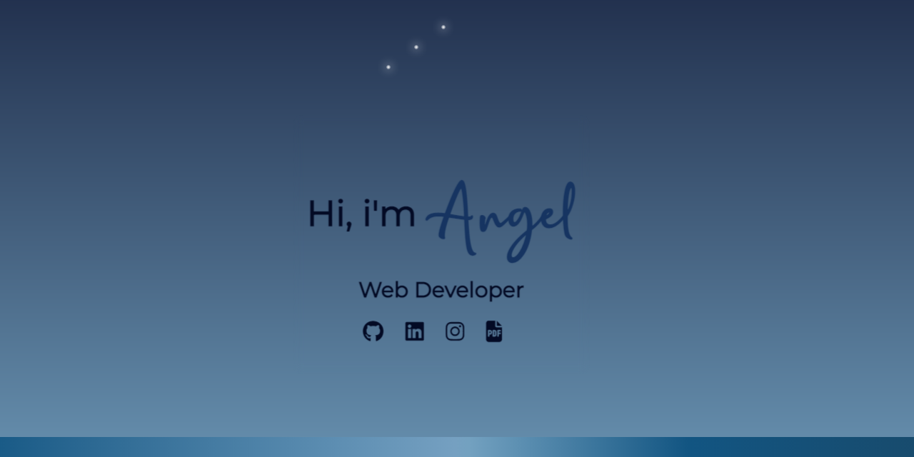

<span align="left">
  
- 👋🏻 Hola, mi nombre es angel.

- 🌱 Soy desarrollador frontend aprendiendo backend.
  
- 👀 Estoy interesado en aprender todo tipo de lenguajes y desarrollo de videojuegos.

- 🔭 Busco colaborar con algun proyecto interesante.
</span>

<div align="center">
  
<a href="https://mlangelpl.github.io/angel-pl" target="_blank">
  <h3>Mi Portafolio</h3>
    
</a>

</div>
##  About Me: 
<span align="left">
 
```
Además de programador soy Matemático,
lo que me facilita elaborar algoritmos.
Me encanta aprender cosas nuevas, leer mangas,
ver animes, ver series, jugar videojuegos  y 
desarrollar videojuegos
```
</span>

## 🚀 Languages and Tools:

<p align="left"> <a href="https://angular.io" target="_blank" rel="noreferrer">  </a> <a href="https://getbootstrap.com" target="_blank" rel="noreferrer">  </a> <a href="https://www.w3schools.com/css/" target="_blank" rel="noreferrer">  </a> <a href="https://firebase.google.com/" target="_blank" rel="noreferrer">  </a> <a href="https://git-scm.com/" target="_blank" rel="noreferrer">  </a> <a href="https://heroku.com" target="_blank" rel="noreferrer">  </a> <a href="https://www.w3.org/html/" target="_blank" rel="noreferrer">  </a> <a href="https://ionicframework.com" target="_blank" rel="noreferrer">  </a> <a href="https://www.java.com" target="_blank" rel="noreferrer">  </a> <a href="https://developer.mozilla.org/en-US/docs/Web/JavaScript" target="_blank" rel="noreferrer">  </a> <a href="https://www.mongodb.com/" target="_blank" rel="noreferrer">  </a> <a href="https://nodejs.org" target="_blank" rel="noreferrer">  </a> <a href="https://postman.com" target="_blank" rel="noreferrer">  </a> <a href="https://www.python.org" target="_blank" rel="noreferrer">  </a> <a href="https://www.typescriptlang.org/" target="_blank" rel="noreferrer">  </a> </p>
  
## 📊 Stats


